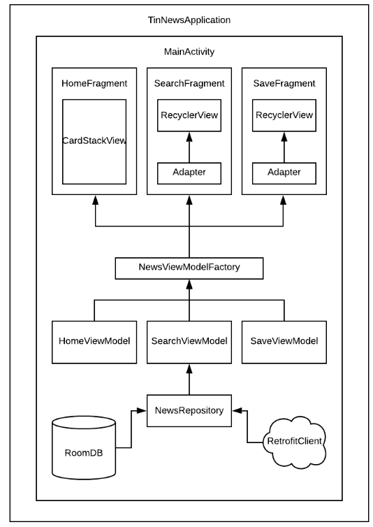

# News Recommendation App

## **Project Description**
An Android news recommendation app that allows users to watch news, search news and save news to local Room database for later view. 

## **Project Architecture**
The project is built with Android MVVC (Model-View-ViewModel) Architecture pattern. 

* The View — that informs the ViewModel about the user’s actions
* The ViewModel — exposes streams of data relevant to the View
* The DataModel — abstracts the data source. The ViewModel works with the DataModel to get and save the data.

The project structure is shown in the image below.

### **MainActivity.class**
Defines the main screen layout to include FragmentContainerView and BottomNavigationView. 
Defines NavHostFragment and NavController to navigation between fragments based on item under bottom navigation menu.

### **NewsApplication.class**
Application contains all other components such as activities and services and is instantiated before any other class when the process for the application/package is created.
onCreate() is called when application is started. Under this method, Room database is created and initialized. 

### **packages**
#### **ui/home**
**_`HomeFragment.class`_**
Display latest news using CardStackView (based on RecyclerView) with defined adapter and layout manager, and utilized CardStackView library (based on RecyclerView) to support swipe animation.
* onViewCreated() is called to notify ViewModel to get latest news and display the result in the Home fragment using CardStackView library.
* swipeCard() is called to bind CardStackView component and trigger swipe animation when like/unlike click event happens. 
* onCardSwiped() is called when a card is swiped. Based on the swipe direction to determine if the card is liked or unliked and at the same time save the liked card in the Room database.

**_`HomeViewModel.class`_**
Works with Model(Repository) layer to get and save data. 
* getTopHeadLines() is responsible for getting the latest news from the RESTful endpoint newsapi.org
* setFavoriteArticleInput(Article article) to save the article to the Room database. 

**_`CardSwipeAdapter.class`_**
Defines the adapter to be used by the RecyclerView.
*ViewHolder is defined to describe an item view and its place within the RecyclerView. Link the item_view layout to the ViewHolder and finish create/bind ViewHolder process in the RecyclerView.
* onBindViewHolder() is Called by RecyclerView to display the data at the specified position. Picasso library is used to display the news content image.

#### **ui/search**
**_`SearchFragment.class`_**
Display news based on search result using RecyclerView with defined adapter and layout manager. 
* onViewCreated() is called to notify ViewModel to query news based on user search keywords and display the result in the Search fragment using RecyclerView.
* Added anonymous implementation of ItemCallback to implement onOpenDetails() methods.
* Under onOpenDetails() method, used navigation component to pass article to the DetailsFragment and display on the screen.

**_`SearchViewModel.class`_**
Works with Model(Repository) layer to get and save data.
* searchNews() is responsible for getting the news from the RESTful endpoint newsapi.org based on the user's search keyword.
* setSearchInput(String query) to set the query keyword. 

**_`SearchNewsAdapter.class`_**
Defines the adapter to be used by the RecyclerView.
* ViewHolder is defined to describe an item view and its place within the RecyclerView. Link the item_view layout to the ViewHolder and finish create/bind ViewHolder process in the RecyclerView. 
* onBindViewHolder() is Called by RecyclerView to display the data at the specified position. Picasso library is used to display the news content image.
* Defined ItemCallBack interface to set up the navigation from SearchFragment to DetailsFragment.
* Added OnClick event to bind the article item to trigger onOpenDetails() method to open DetailsFragment for article details.

#### **ui/save**
**_`SaveFragment.class`_**
Display saved news/articles using RecyclerView with defined adapter and layout manager.
* onViewCreated() is called to notify ViewModel to get all saved(liked) articles from Room database and display them in the Save fragment using RecyclerView.
* Added anonymous implementation of ItemCallback to implement onRemoveFavorite() and onOpenDetails() methods. 
* Under onOpenDetails() method, used navigation component to pass article to the DetailsFragment and display on the screen.

**_`SaveViewModel.class`_**
Works with Model(Repository) layer to get data and delete data from Room database.
* getAllSavedArticles() is to get all saved articles from Room database. 
* deleteSavedArticle(Article article) to delete a specific article from Room database. 

**_`SavedNewsAdapter.class`_**
Defines the adapter to be used by the RecyclerView and added ItemCallback interface to relay the events from inside SaveNewsAdapter to SaveFragment.
* ViewHolder is defined to describe an item view and its place within the RecyclerView. Link the item_view layout to the ViewHolder and finish create/bind ViewHolder process in the RecyclerView.
* onBindViewHolder() is Called by RecyclerView to display the data at the specified position.
* Defined ItemCallBack interface to achieve article delete function and set up the navigation from SaveFragment to DetailsFragment.
* Added OnClick event to bind the "thumb_up" icon to trigger onRemoveFavorite() method to delete article from database. 
* Added OnClick event to bind  the article item to trigger onOpenDetails() method to open DetailsFragment for article details. 

#### **ui/details**
**_`DetailsFragment.class`_**
Display the details page of news. DetailsFragment is opened from tapping on a search result from SearchFragment or a saved article item from SaveFragment.
* onViewCreated() is called to notify ViewModel to get latest news and display the result in the Home fragment using CardStackView library.
* swipeCard() is called to bind CardStackView component and trigger swipe animation when like/unlike click event happens.
* onCardSwiped() is called when a card is swiped. Based on the swipe direction to determine if the card is liked or unliked and at the same time save the liked card in the Room database.

#### **model**
* Defined the Java model classes that map to the server-side JSON format data.
* With the use of Room ORM, model classes also map to the tables in the Room database. 

#### **repository**
**_`NewsRepository.class`_**
* Used Retrofit to implement the NewsApi interface. And utilized the retrofit method to get data from endpoint and and hold the data in LiveData.
  * getTopHeadlines() to get the latest news from newsapi.org. 
  * searchNews() to get the news from newsapi.org based on user's search keyword. 

* Used an AsyncTask to access Room database and dispatch the CRUD work to a background thread.
  * favoriteArticle(Article article) to save liked news/article to the Room database. 
  * getAllSavedArticles() to get all saved articles from Room database.
  * deleteArticle(Article article) to delete a specific article from Room database. 

**_`NewsViewModelFactory.class`_**
Create ViewModel based on the ViewModel.

#### **network**
* Configured Retrofit instance and defined REST APIs to send request to the endpoint (newsapi.org) and returns response. 

#### **database**
* Defined Room database and APIs. 

## **Page Navigation**
Utilized Jetpack navigation component to control page navigation (navigate between multiple fragments) in the MainActivity bottom bar. 
There are 4 fragments in the navigation graph. 

### **Fragments**
**_`HomeFragment`_**
Allow users to view all top headline news. Utilized CardStackView library (based on RecyclerView) allow users to swipe news card for like and unlike.

**_`SearchFragment`_**
Allow users to search news based on keyword. Utilized RecyclerView to display each view item in the defined layout. 

**_`SaveFragment`_**
Allow users to view all the saved articles in the Room database and delete specific articles from the database. 

**_`DetailsFragment`_**
Display detailed page of article after user tapping on a search result from SearchFragment or a saved article item from SaveFragment. 
